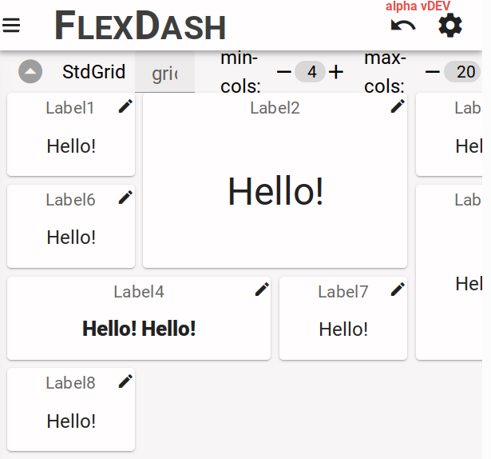
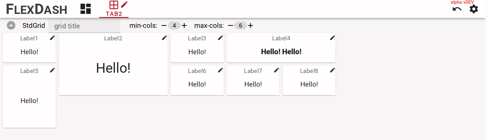
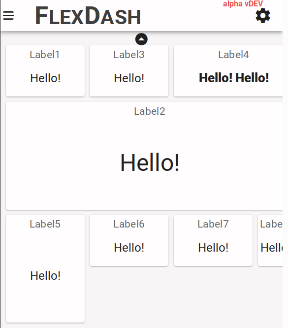
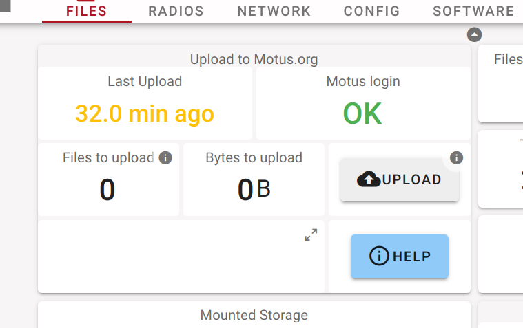
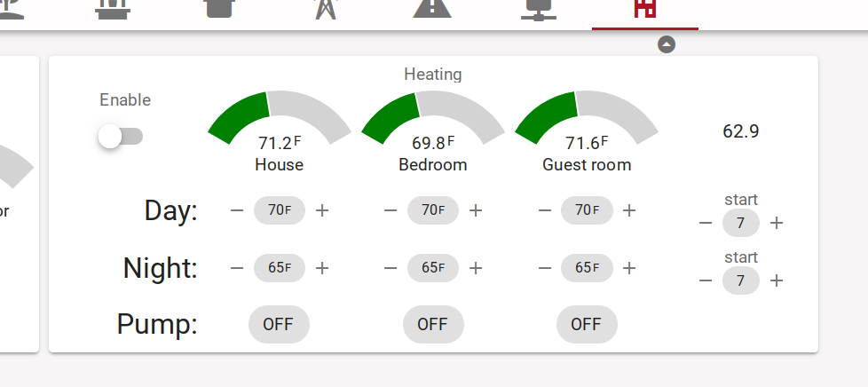
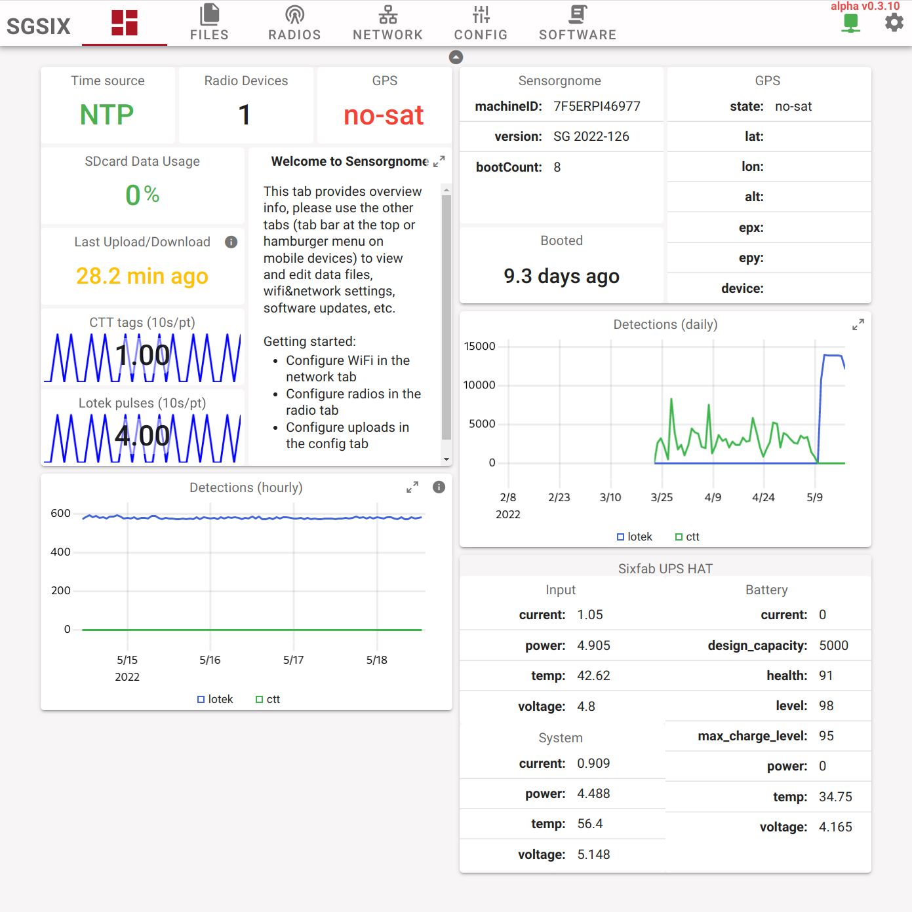
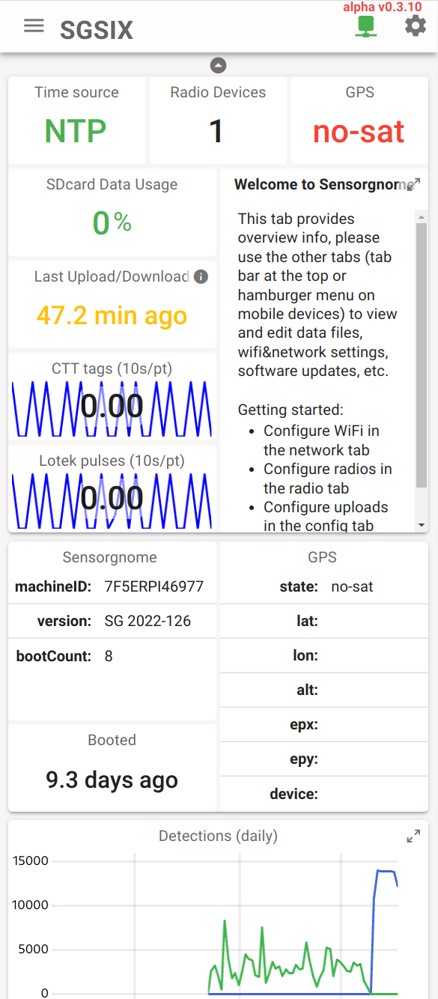
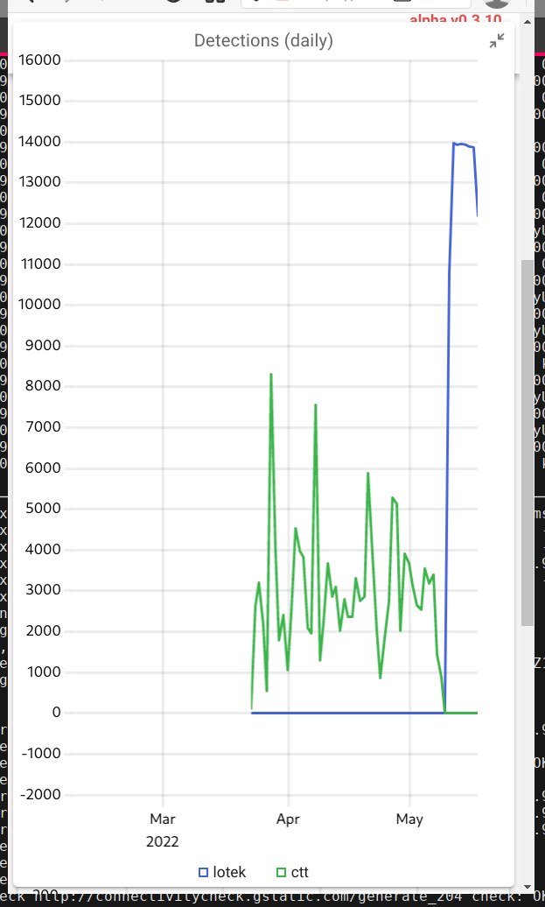

# Grid and Panel layout

The primary containers in FlexDash to lay out widgets are grids and panels.
Both place a linear list of widgets into a two dimensional grid from top-left to
bottom-right and both support widgets that span multiple rows or multiple columns.
The main difference between grids and panels is that grids reflow widgets as the
browser screen width changes while panels maintain a fixed layout of widgets.

## Grids

Grids display a two-dimensional grid of widgets where all columns have the same width and all
rows have the same height. The column width is a minimum of 120px and there is an 8px gap between
columns. The column width stretches so an integral number fills the width of
the browser window, this means that the maximum theoretical column width is 247px (a very narrow
window showing a single column before the jump the two columns).
The height of the grid rows is fixed at 78px (a 3/2 width/height aspect ratio) with an 8px gap.

<figure markdown>
{width="862"}
<figcaption>Grid with 8 widgets of varying sizes displayed in a relatively wide browser window.
The last widget (Label8) reflowed to the next row.
</figure>

<figure markdown>
{width="509"}
<figcaption>The same grid as above displayed in a narrower browser window. Label4 reflowed to
the end of the second row leaving gaps which Label5 and Label6 moved into out of order.
</figure>

The reflowing of the grid can be constrained by specifying a minimum number of columns as well
as a maximum. The max constraint can avoid awkward wide layouts on very wide displays and the
min constraint can be helpful for mobile device layout to avoid excessively narrow layouts,
possibly forcing the user to either pan or hold the device in landscape orientation.

<figure markdown>
{width="308" align="left"}
<figcaption>The same grid as above displayed in a narrow window with min-cols=4 to constrain
the minimum number of columns. The browser window is slightly narrower than the minimum space
required by 4 columns causing the grid to be clipped.
</figure>

<figure markdown>
{width="308" align="left"}
<figcaption>The same grid as above displayed with max-cols=6 to constrain
the maximum number of columns.
</figure>

<figure markdown>
{width="293" align="left"}
<figcaption>Enlarging Label2 to occupy 4 columns causes the minimum grid width to match
that dimension. When displayed in a narrow window this causes other widgets to be clipped too.
</figure>

## Panels

Panels also display a two dimensional grid but the number of columns is fixed and are of half the
size of grid columns. Panels are placed into a grid just like widgets
(from the grid's point of view a panel is a widget) thus they span a fixed number of grid columns
and rows. A panel then has twice the number of columns for its internal grid and an arbitrary number
of rows.
The columns are generally equal-width and the rows are minuimal-height with extra space equally
distributed.

The background of a panel can be either solid or transparent. A transparent background gives the
look of a number of widgets that are grouped together while a solid background eliminates boundaries
between widgets and makes the panel look like a larger compound widget.

<figure markdown>
{width="380"}
<figcaption>Panel with 7 widgets and transparent background used to force a fixed layout
of the widgets as the panel acts like a big widget in terms of reflowing in the grid.
The 7 widgets in the panel can be seen clearly.
The panel is 3 grid columns wide and it itself has 6 columns for its widgets.
The widgets in the top row are 3 cols wide while the ones in the second row are 2 cols wide.
All the widgets are 1 row high making them all equal height.
</figure>

<figure markdown>
{width="489"}
<figcaption>Panel with 19 widgets and solid background making it look like one big widget.
Using a panel like this can avoid having to develop a custom widget.
</figure>

<figure markdown>
{width="484"}
<figcaption>Same panel as above with edit mode turned on showing the boundaries (and edit
buttons) of all the widgets.
</figure>

## Tips and tricks

### Creating compound widgets

An example of a compound widget is shown ine the figure above. Some of the tricks used are:

- label widgets are useful to place text because they provide control over font size and
  text alignment, e.g. the "Day:", "Night:" labels
- stat widgets without title are useful to display set points and other control values
- use buttons with icons to implement actions

### Creating mobile layouts

Narrow cell phone screens are approx 3 grid columns wide, setting min-cols on a grid to 3
forces this even on phones that show a smidge under 3 columns.

Grouping widgets into panels that are 3 cols wide creates a type of card layout that works
well both on narrow phone screens as well as "normal" desktop screens, setting max-cols to
6 or 9 avoids awkward super-wide layouts.

<figure markdown>
{width="696"}
<figcaption>Tab with phone-friendly layout consisting of 3 panels and 2 plots that are all 3
columns wide. The grid is set to max-cols=6 so in a desktop window the panels end up organized
2-wide.
</figure>

<figure markdown>
{width="293"}
<figcaption>The same layout viewed on a narrow phone shows the panels laid out vertically
one after the other.
</figure>

Many widgets can be maximized, thus a graph can be presented in a relatively small
widget and the user can maximize it to view the details, the same applies to the markdown
widget and others.

<figure markdown>
{width="293"}
<figcaption>The same layout again with one of the plots maximized.
</figure>

