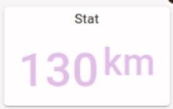
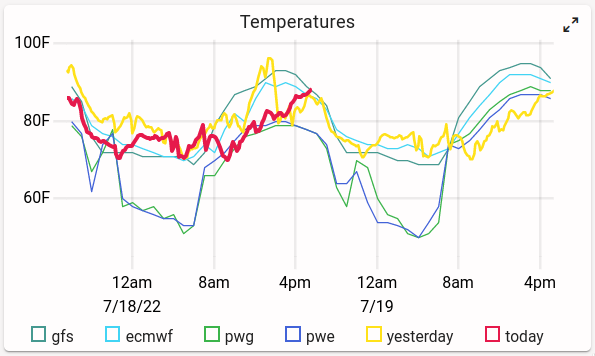

# Mirror state -- don't send messages

Node-RED and FlexDash communicate by mirroring state, not by sending messages.
(At least, that's the abstraction that FlexDash provides to nodes and widgets,
underneath there are indeed messages being sent.)

In Node-RED flows everything happens via messages.
One node sends a message to another, that one does something, and sends messages of its own.
This works great because there is one single run-time.
When dealing with browsers, however, there may be multiple browsers connected which
is typically dealt with by multicasting messages to all of them.
However, browsers also come and go, and when a new browser connects it needs to be initialized
so it looks the same as the others and so it can meaningfully follow the flow of messages from there on.

The abstractions provided by FlexDash solve this issue by caching the state of the dashboard on
the server side, i.e. in Node-RED.
When a new browser connects, it is initialized with the current state of the dashboard from the
cache and can thereafter accept changes to the state like other already-connected browsers.

So the important concept here is that messages modify the state of the dashboard
_held in the cache in Node-RED_.
From that cache the node-red-flexdash plugin mirrors this state to all browsers so they
always have up-to-date data, and then inside of FlexDash (on the browser side) Vue propagates
that state to all the widgets, which then propagate it to the DOM.
This means that messages that arrive at a FlexDash node in Node-RED should modify that dashboard state,
and then these state changes ripple their way through to browsers, to Vue, to widgets,
to the DOM, and finally to the screen.

## Stat widget example

{width="25%" align="right"}
The (simplified) stat widget used for this example has 3 properties: title, payload, and color.
It displays a title at the top and the payload as value in the chosen color.

Internally, the stat _node_ simply copies the three props from an incoming
message to the state of the dashboard. Something like this:

```javascript
this.on('input', msg => { // Node-RED message input handler
  if ('title' in msg) widget.set('title', msg.title)
  if ('payload' in msg) widget.set('payload', msg.payload)
  if ('color' in msg) widget.set('color', msg.color)
})
```

Here the variable `widget` is a reference to the WidgetAPI object that the node gets from
node-red-flexdash in order to be able to modify the cached state for its widget.

Given a message like `msg = { color: "red", payload: 42 }` the state of the dashboard cached in
the node-red-flexdash plugin might end up with something like this:

```javascript
{
  ...,
  "widgets": {
    "stat-1": {
      "title": "Temperature", // unchanged
      "payload": 42, // just changed
      "color": "red" // just changed
    },
    "stat-2": { // all unchanged
      "title": "Humidity",
      "payload": 34,
      "color": "green"
    },
    ...
  }
}
```

Assuming that `widgets['stat-1'].payload` and `widgets.['stat-1'].color` indeed just changed
value then the plugin would send a message to all browsers with those two new values.
A browser that newly connects after all this would receive the full state and be up-to-date.

## Time series plot example

{width="40%" align="right"}
The stat example is very simple because it only deals with plain values.
A time series plot has more complicated state:
this example uses a simplified TimePlot widget that has 3 properties: title, payload, and labels.
The title is a simple string and can be handled like in the stat example.
The labels are an array of strings, one label for each time-series.

The payload holds the series for the plot in a row-wise configuration, that is, payload is
an array where each element is again an array holding a timestamp and one value per series:

```javascript
[
  [ 1234567890, 1, 2.0, 100 ], // timestamp, series 1, series 2, series 3
  [ 1234567891, 1, 2.5, 99 ],
  ...
]
```

The labels can be handled quite simply because the props can hold arbitrary JSON-compatible
data structures.
So a simple assignment works just fine (in a real implementation it may be helpful to perform
some validation first):

```javascript
if ('labels' in msg) widget.set('labels', msg.labels)
```

### Update the full data set

For the payload we need to contemplate two different cases: the input message holds a full data set
(i.e. a 2D array with all the data points to display) or it holds a single data point (i.e. a 1D
array) that should be appended to the existing data.

The first case can be handled with a simple assignment (assuming an appropriate implementation
of the `is2DArray` helper function):
    
```javascript
if (is2DArray(msg.payload)) widget.set('payload', msg.payload)
```

### Append a row to the data
The second case can be handled by appending the new data point to the existing array:

```javascript
if (is1DArray(msg.payload)) {
  widget.push('payload', payload) // same functionality as Array.push()
}
```

An alternate implementation is to use the `set` method using an index one past the last
existing element of the array:

```javascript
if (is1DArray(msg.payload)) {
  const length = widget.get('payload').length
  widget.set(`payload/${length}`, payload) // basically data[data.length] = payload
}
```

This takes advantage of the fact that the `set` method accepts a prop path that can walk down
into the data structure of a prop and that `/` is used instead of `[..]` to index into
arrays and objects.

In either of these two implementations the end effect is that the node-red-flexdash plugin will send
just the new value to connected browsers.

### Remove old data points

All this leaves one more operation, which is to remove old data points when the amount of data 
exceeds what the widget can reasonably display, say 100 data points.
    
```javascript
if (is1DArray(msg.payload)) {
  const length = widget.get('payload').length
  for (let i=0; i<100-length; i++) widget.shift(`payload`) // see as Javascript Array.shift()
}
```

An important implementation detail here is that the `shift` operation is sent as operation
to the browsers so they all perform a shift on the array, no array values are transferred.
In contrast, the following implementation would send the entire array to all browsers:
    
```javascript
    // DO NOT DO THIS!
    if (is1DArray(msg.payload)) {
      const payload = widget.get('payload')
      while (payload.length > 100) payload.shift()
      widget.set('payload', payload) // sends the entire array: every element has changed
    }
```

#### Notes:

The widget API currently has a very limited set of operations, but this can be extended
as more use-cases develop.

The widget API is not currently available in custom widgets.
