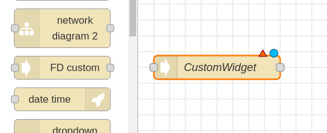
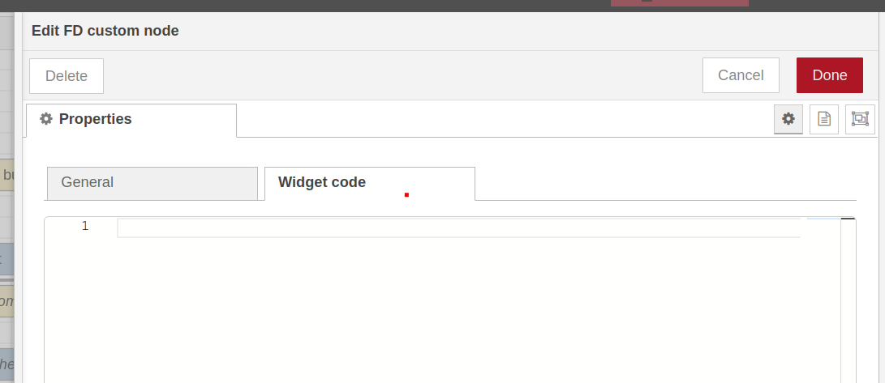
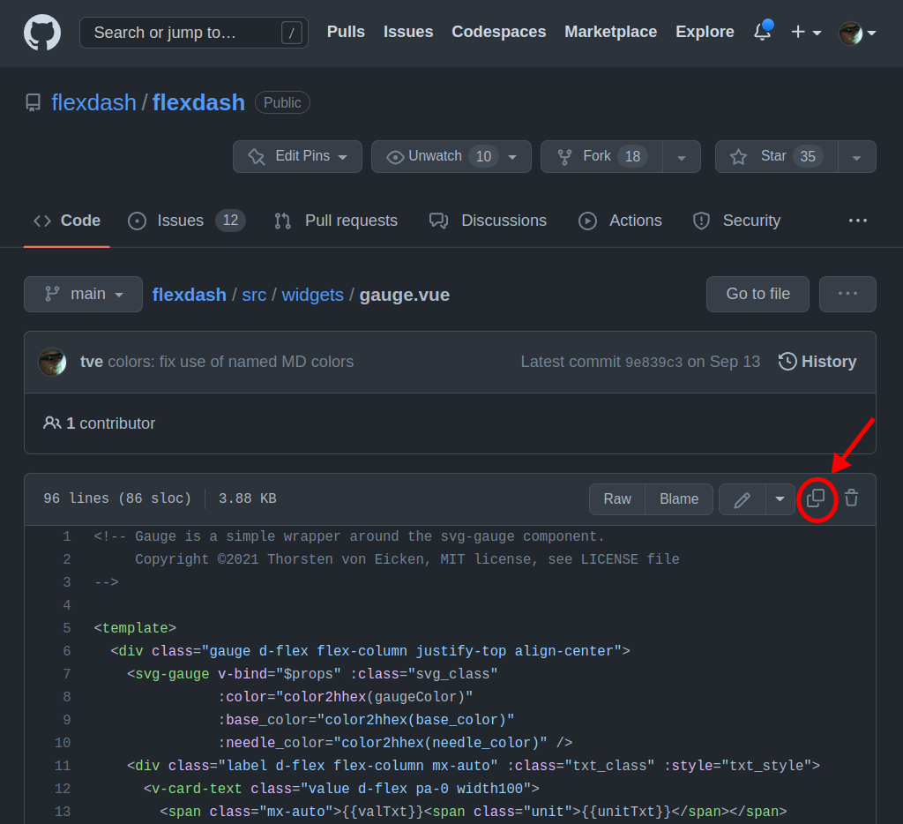
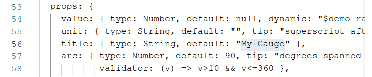
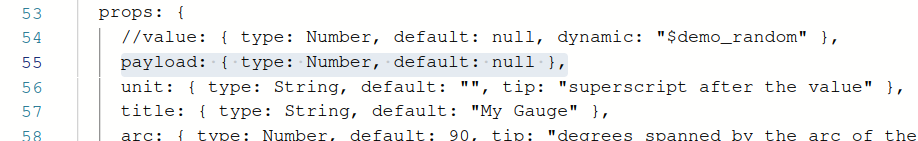
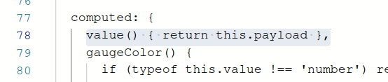
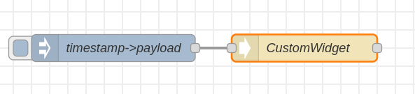
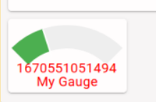

# Quickly modify an existing widget

This section walks through the steps to modify an existing widget.
If you are familiar with Vue this may be all you need to start writing your own widgets
(but check out the section on FlexDash extensions to Vue components).
If you are not familiar with Vue, follow along even if you don't understand the details so you
can immediately try out what is described in subsequent sections.

The example used here is to create a gauge widget from the `gauge` widget without any
material change. The example assumes that you have a FlexDash dashboard created and ready
to have widgets added.

### 1. Create an empty custom widget

Drag a `FD custom` node into a flow and open the widget code tab on its property page.

{width="50%"}

In the node's general tab set the desired FlexDash container.
Then erase the provided placeholder widget code:

{width="80%"}

### 2. Copy the source code

Open the FlexDash source directory with all the built-in widgets in a browser at
[https://github.com/flexdash/flexdash/tree/main/src/widgets](https://github.com/flexdash/flexdash/tree/main/src/widgets),
then open the widget you want to clone, e.g. `gauge.vue` and
use the "copy" icon to copy the widget code to the clipboard:



Paste the source code into the previously opened Node-RED custom widget tab.

### 3. Adapt the source code

A custom widget is slightly different from a widget in the FlexDash source tree and
may need a couple of changes to work.

Any imports from the FlexDash source tree need to change because custom widgets can't
import from FlexDash's source directory.
Instead, FlexDash provides references to many of its modules via the `window` variable.
More details below, but change the imports around line 40 as follows:

```js
// import SvgGauge from '/src/components/svg-gauge.vue'
const SvgGauge = window.Palette.components['SvgGauge']
// import { color2hhex } from '/src/utils/colors.js'
const color2hhex = window.Utils['colors'].color2hhex
```

Delete the `name` property a few lines down: custom widgets don't have a name
(you can leave the name in, it simply gets ignored).)

Change any props defaults in the source code because there is no "Widget input props" tab.
For example, change the title default to "My Gauge":

{width="80%"}

Finally, the standard FlexDash widgets don't use a `payload` prop because they're not specific
to Node-RED. The standard FD Gauge node translates `payload` to `value`. You can either inject
the `value` prop in your flows or rename `value` to `payload` in the widget code.
The easiest way to perform the rename is to add a computed value, the alternative is to track down
all uses of value.
(The screen shot below shows the `dynamic` property removed from the payload, it has to do with
a FlexDash demo mode which is of no import here, leaving it in has no ill effects.)

{width="90%"}

{width="60%"}

### 4. Deploy the widget

Close the custom widget properties ("Done" button) and prepare an inject node to send it
some values (setting either the 'payload' or 'value' property depending on whether you made the
edit above).

{width="50%"}

Deploy and inject:

{width="20%"}

Done! Except that using timestamp with gauge isn't a great match...

### Notes:

- It is recommended to stick to Vue's "options API", the "composition API" may or may not work.
- All props can be set dynamically by sending a message with a field with the same name
  as the targeted prop. However, prop names starting with underscore are reserved (blocked).
