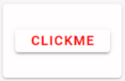

# Vue primer

{width="25%" align="right"}
FlexDash uses the highly popular Vue 3 web framework.
Beyond its popularity, which ensures that there are many tutorials and examples out there,
the benefit of Vue is that it has a relatively soft learning curve and that it provides
some structure for the UI code.

Vue uses "enhanced" web components. A web component is a piece of code that gets
instantiated on a web page using an HTML tag. E.g., just like `<h1>...</h1>` produces
a heading on the page writing `<my-widget>...</my-widget>` can produce an instance of
a Vue component.

To write a Vue component up to three parts are necessary:

  1. An HTML template: this is a fragment of HTML that replaces `<my-widget>...</my-widget>`
    or put differently, this is the HTML that renders the component.
  2. A piece of javascript code: this is what implements the dynamic functions of the
    component.
  3. A CSS style sheet that provides styling for the component's HTML.

One nice aspect of Vue is that is allows these three parts to be combined into a single file
(this is called Single File Components, or SFC, in Vue) and the file extension is `.vue`.

{width="25%" align="right"}
(Note that technically a minimal widget can consist of just a template or just a script
with a render function, but in practice the vast majority of FlexDash widgets have a template
and a script, and many have some CSS too.)

In addition to using Vue 3 FlexDash also uses the Vuetify 3 toolkit.
Vuetify is essentially a web component library that provides an implementation for many
typical UI components such as buttons, data tables, menus, forms, text fields, icons, etc.

## A very simple widget

A FlexDash widget is a Vue component that follows some additional conventions and that is
flagged to FlexDash as being a widget.

There are many excellent Vue tutorials
(e.g. [the official one](https://vuejs.org/tutorial/#step-1)),
the intent of the example in this section is
to complement these by showing a complete FlexDash widget example that uses some of the
conventions used by FlexDash and that explains how all the pieces, including the Node-RED ones,
hang together.
The example used is a `simple-button` widget displays a button with a custom label and that
outputs a value when clicked.

For the sake of formatting, the HTML, CSS, and Javascript portions of the `.vue` file
(or the custom widget edit pane) are shown below separately.
They are simply concatenated one after another in any order in the actual `.vue` file.

### HTML template

When a widget is rendered by FlexDash, its HTML is inserted into a "card",
so the widget only needs to render the content of that card.
For example:

```html
<template>
  <v-btn variant="elevated" class="ma-auto" @click="clicked()">
    <span class="label">{{ label }}</span>
  </v-btn>
</template>
```

This template consists of a single outer HTML tag: v-btn, which is a button component provided
by Vuetify (all Vuetify components start with "v-").
The elevated variant has a drop shadow giving the button an elevated look and "ma-auto" is
a Vuetify spacing helper class that adds a `margin: auto` CSS tag to the component,
which causes it to be vertically and horizontally centered in its HTML container,
i.e. the above-mentioned card.

For more details:

- [Vuetify buttons](https://next.vuetifyjs.com/en/components/buttons/)
- [Vuetify CSS spacing helpers](https://next.vuetifyjs.com/en/styles/spacing/)

Within the button comes the text the button displays, which is the content of a (yet to be defined)
variable called label.
The `{{`..`}}` notation is used to insert the output of a Javascript fragment, which here is
just the content of a variable.

The `@click` is a [Vue notation](https://vuejs.org/api/built-in-directives.html#v-on)
that causes the code on the right of the = to be executed when the
component emits an event called 'click'.
(The '@click' is short-hand notation for `v-on:click`.)
In this example a (yet to be defined) method 'clicked' is called.

Note that as part of Vue's pre-processing of the template the `this` object references are added,
thus `label` turns into `this.label` and `clicked()` turns into `this.clicked()`, where `this`
refers to the component's object as defined in the Javascript portion of the SFC.

### Javascript

The Javascript for the simple-button widget is:

```javascript
<script>
export default {
  name: 'SimpleButton', // the name of the widget

  // Help text shown in the Node-RED info pane of the node.
  help: `Button to send a message.
Pressing the button sends a message with the value of the \`output\` prop as payload.
The button may contain a label that is shown centered in the widget.`,

  // Props are the inputs to the widget, they can all be set from Node-RED either statically
  // in the flow editor UI or dynamically using msg.<prop_name>.
  // The tips show in the flow editor below the input fields.
  props: {
    label: { default: "clickme", tip: "text to show inside button" },
    output: { default: "I was clicked", tip: "value to output when clicked" },
  },

  output: true, // signals to FlexDash that the widget can output a message

  // simple methods within the component
  methods: {
    clicked() { // handle the clicking of the button, i.e., the handler for the '@click'
      this.$emit('send', this.output) // emit an event (Vue concept), a 'send' event goes to NR
    }
  }
}
</script>
```

Some of the fields of this Javascript object are not relevant when using the custom widget node:

- The `name` field must be globally unique but is ignored when using the custom widget node
  and can be omitted.
- The `help` field is also ignored when using the custom widget node.
- The `output` field is ignored when using the custom widget node, at the moment all widgets
  built using the custom widget node are assumed to have an output.

### CSS

The CSS for the simple button widget is:

```css
<style scoped>
  .label { color: red; }
</style>
```

The `scoped` attribute of the style tag causes Vue to apply the CSS only to the elements in
the template.
This is convenient to avoid affecting other components in FlexDash.

Note that the CSS does not apply recursively down, i.e., components instantiated by
`v-btn` are not affected by the CSS.
It is however possible to affect elements down the hierarchy using the `:deep` selector,
see the [Vue documentation](https://vuejs.org/api/sfc-css-features.html#scoped-css).

## Result

The resulting widget looks as follows in FlexDash:

{width="20%"}
