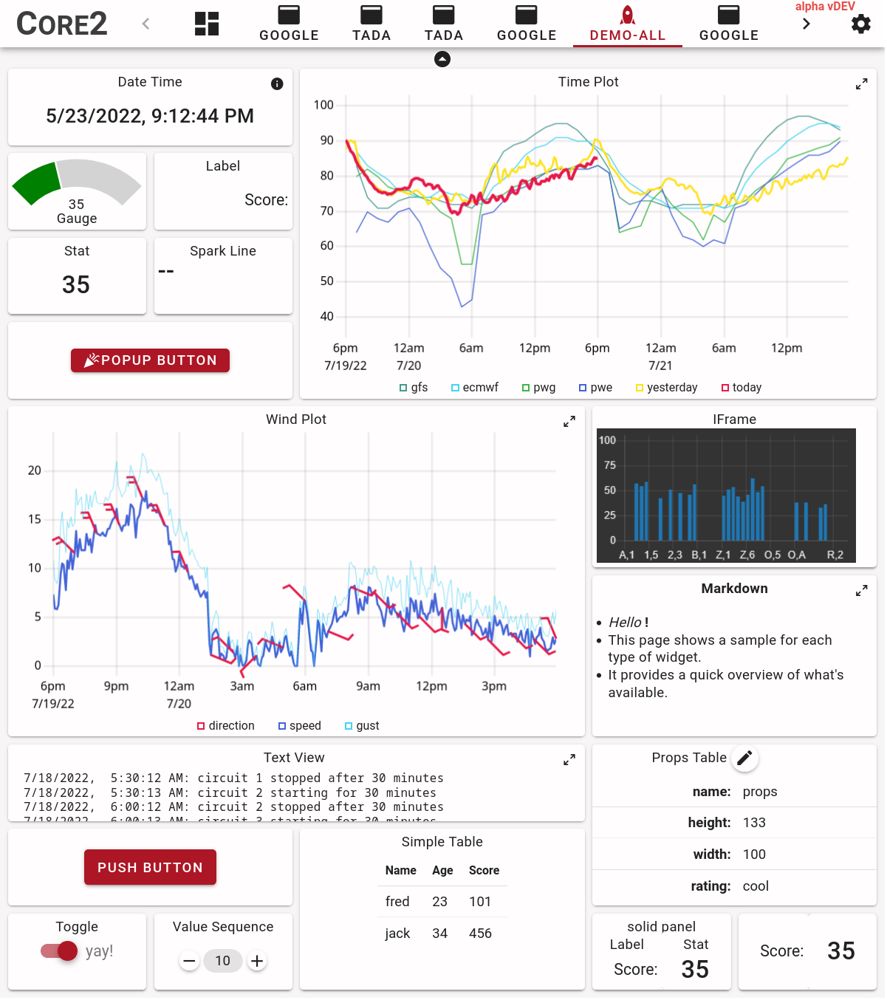

# Introduction

FlexDash is a web dashboard that displays information in the form of widgets and lets the user
perform actions with buttons and other controls.
The overall layout uses grids, but this can be extended using custom layout components.

{width="500"}

FlexDash is completely independent of Node-RED and can be integrated into any web back-end
using websockets or socket.io but a deep integration into Node-RED is also available and the
latter is the primary focus of this documentation.

!!! NOTE
    The current documentation focuses on using FlexDash with Node-RED.
    There is nothing Node-RED specific in FlexDash, it can be used with many other back-end
    systems, however the Node-RED integration of FlexDash uses FlexDash in a special
    constrained manner.

## License

FlexDash and its Node-RED integration use the MIT license, which means everything is free.
FlexDash is not a free offering of some company withholding the good stuff for a paid
version: what you see is what you get.
There is no company behind FlexDash and there are no plans for one (been there, done that,
don't want to do it again).
Enjoy and contribute back! :beer:
