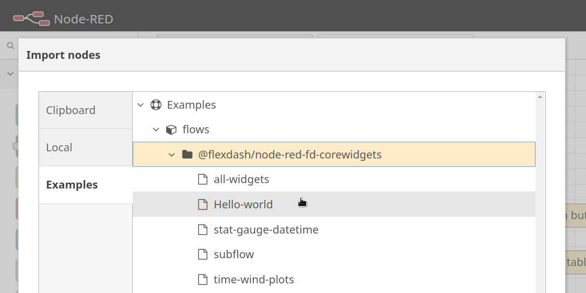
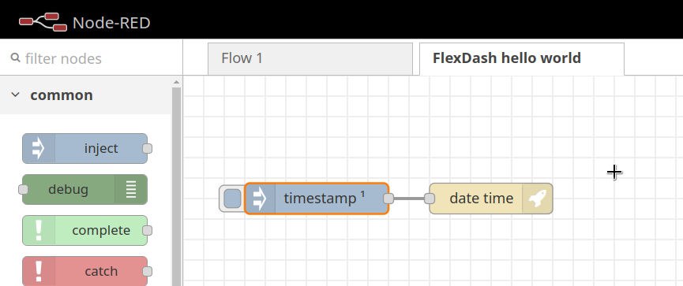
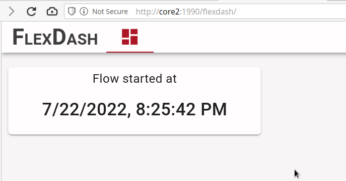
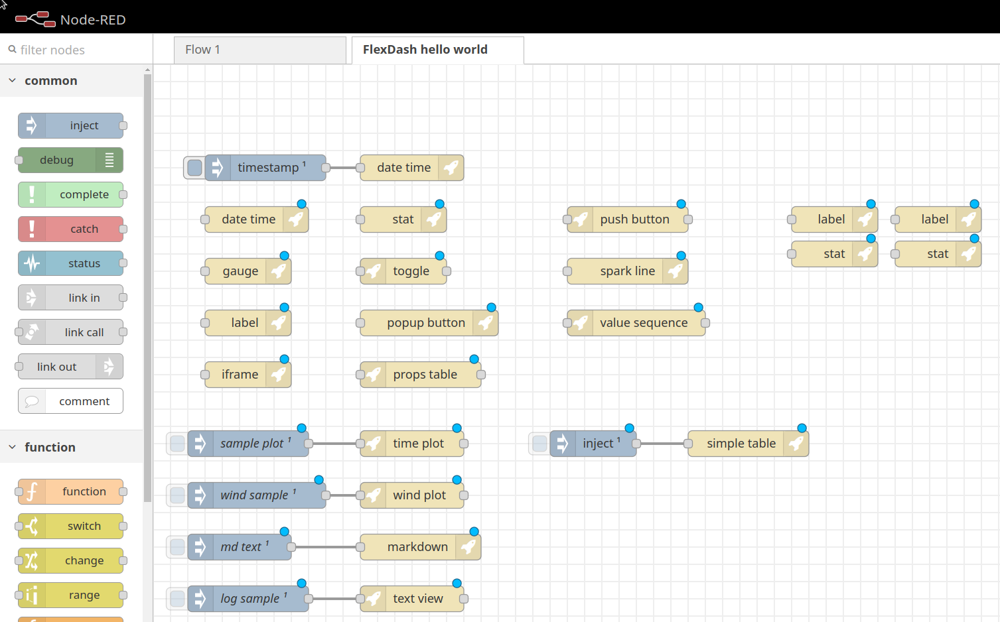
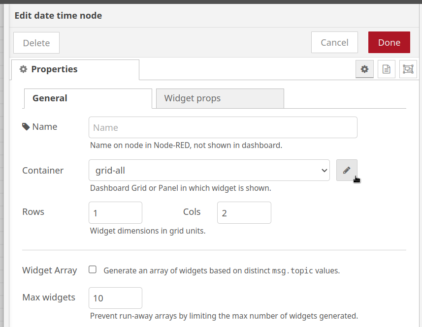
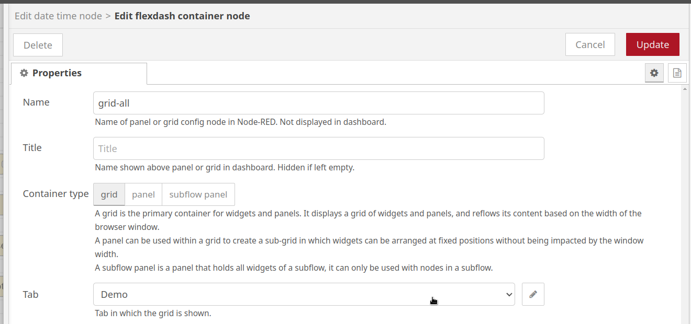
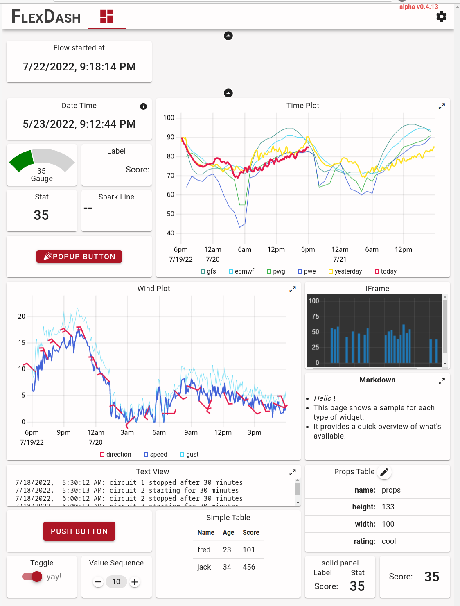

# Examples

The examples are easy to run as long as the `Hello World` example is run first!
It creates config nodes (dashboard and tab) that the other examples "hook into".
If you do not run `Hello World` first you have to create these two config nodes yourself
(not a big deal).

Here is how it ought to look.

## Hello World Example

<figure markdown>
{width="75%" align="right"}

Use the "import" feature in the Node-RED editor (in the top-right menu)
to install the "hello world" example, from `@flexdash/node-red-corewidgets`.
</figure>

<figure markdown>
{width="75%" align="right"}

When the import completes you should have the following flow with an inject node
and a date-time widget to display the timestamp.
</figure>

<figure markdown>
{width="75%" align="right"}

Open another browser tab with the FlexDash dashboard, typically
[http://localhost:1880/flexdash](http://localhost:1880/flexdash), the host & port being the
same you use for the Node-RED flow editor and just with `/flexdash` as path.
</figure>

## All Widgets Example

The all-widgets example shows one of each built-in widget so you get an overview of
what's available. Import the flow using Node-RED's "import" feature as you did for the
hello-world example.

<figure markdown>
{width="75%" align="right"}

This is about how it looks after the import if you import the example into the same flow
as the hello-world example.
</figure>

<figure markdown>
{width="75%" align="right"}

You need to associate the `FlexDash grid` config node used by all the new example
widgets with the `FlexDash tab` imported with the hello-world example:

- double-click any new yellow FlexDash node
- switch to the `general` tab
- ensure the `grid-all` container is selected and click the pencil to edit it
</figure>

<figure markdown>
{width="75%" align="right"}

- ensure the `Demo` tab is selected
- click the red `update` and then the red `done` button
- deploy
</figure>

<figure markdown>
{width="75%" align="right"}

Switching to the FlexDash browser tab you should see the following.
</figure>

## Next Steps

- The other examples show variations for each of the widgets.
- Read about FlexDash's [core concepts](../using-flexdash/core-concepts.md).
- Add some widgets and feed them data, see the "info" tab in the
  Node-RED flow editor for help on each of the widgets.
