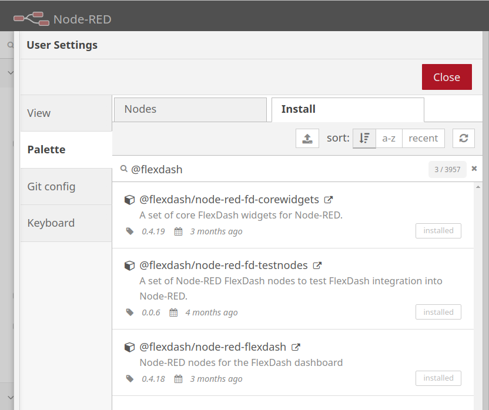

# FlexDash w/Node-RED: Quick Start

To quickly try something out it is recommended to use docker.
While docker can be confusing at the beginning, the [docker quick-start page](docker.md)
attempts to provide enough examples and explanations to perform simple tasks without much
prior knowledge.
The big benefit of using docker is that it's easy to throw away tests and to start again
from a clean sheet, i.e., known-good configuration.

Alternatively, you can also easily install FlexDash on a regular Node-RED installation.

## All the Pieces

FlexDash consists of a number of parts:

- [FlexDash](https://github.com/flexdash/flexdash) is a single-page web application that runs
  in the browser and displays the dashboard.
- [Node-RED-FlexDash](https://github.com/flexdash/node-red-flexdash) is a Node-RED
  module that contains the main integration into Node-RED. It is the server part with
  which the FlexDash dashboard communicates.
- [Node-RED-FD-CoreWidgets](https://github.com/flexdash/node-red-fd-corewidgets) is a
  Node-RED module that contains Node-RED nodes for most of the widgets that are built into
  FlexDash.

## Installing FlexDash using Docker

Follow along with the [docker quick-start page](docker.md).

## Installing FlexDash in Node-RED

For a non-docker set-up, the recommended method is to install FlexDash
using `npm install @flexdash/node-red-fd-corewidgets`,
this will automatically pull-in the other necessary parts as dependencies.

<figure markdown>
{width="60%" align="right"}

You can also use the "manage palette" feature in the Node-RED editor (in the top-right menu)
to install "@flexdash/node-red-fd-corewidgets", however, a restart of Node-RED is required
after the installation!
</figure>

!!! WARNING
    When installing (`@flexdash/node-red-fd-corewidgets`) using the
    "manage palette" feature a restart is required due to
    [bug #569 in Node-RED](https://github.com/node-red/node-red/issues/569).

The core widgets module comes with a set of example flows, which you can install using the
Node-RED editor's "import" feature. See the [next section](examples.md).
