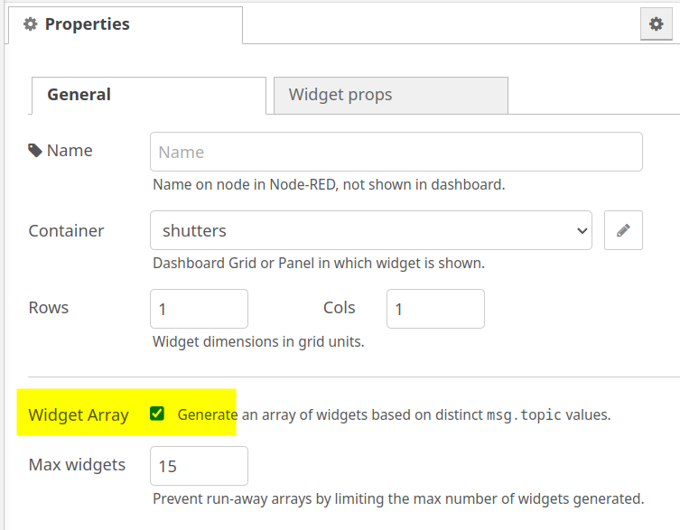
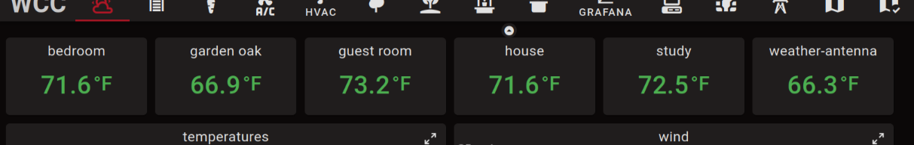

# Array Widgets

<figure markdown>
{align="right" width="50%"}

Widgets can be configured into a dynamic array by checking a box on their configuration tab.
Normally a widget node in Node-RED corresponds to one widget in the dashboard.
When configured as an array the widget node starts out without any widget in the dashboard.
Then, for each message with a unique `msg.topic` sent to the node a new widget is shown in the
dashboard.
</figure>

One use-case is to consolidate configuration for a number of widgets.
For example, for window shutters one might want a number of buttons to position the shutters
at various positions. The following code in a function node produces the configuration for
6 buttons:

```
const pos = ['up', '25%', '50%', '80%', '90%', 'shut']
const colors = ['orange', 'blue', 'blue', 'blue', 'blue', 'orange']
return [
    pos.map((p,ix) => ({
        topic: ix,
        title: p,
        color: colors[ix],
        output_value: p,
    }))
]
```

This produces 6 messages with 6 different topics. Fed into a button node with the array mode
checked will result in 6 button widgets in the dashboard.
The order of these widgets is in sorted topic order, which is why the topic is set to the index.

Another use-case is to generate a variable number of widgets depending on external inputs, such
as the number of sensors actually deployed.
Suppose a number of sensors send temperature information via MQTT arriving as messages like:

```
{ location: 'bedroom', payload: '68', unit: '°F'}
```

This sensor data could be displayed in an array of stat widgets by transforming the messages
in a function node:

```
return {
    topic: msg.location,
    title: msg.location,
    value: msg.payload,
    unit: msg.unit,
}
```

Here the location name is used as topic, hence the widgets will be sorted alphabetically by
location. The result might look like this:

<figure markdown>

</figure>

## Deleting array elements

It is also possible to delete a topic, and thus a widget, by sending a message
with the topic and an attribute `_delete` with a truthy value, for example:

```
{ topic: 'bedroom', _delete: true }
```

The set of topics active in an array widget is held in memory.
As long as Node-RED is not restarted the set of topics is preserved,
but when Node-RED is restarted it starts out empty again.

_Note: there should be a way to delete all topics using a message, but that is
not currently implemented._
