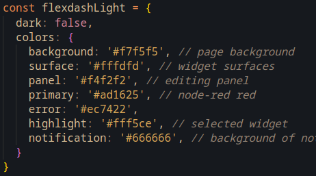
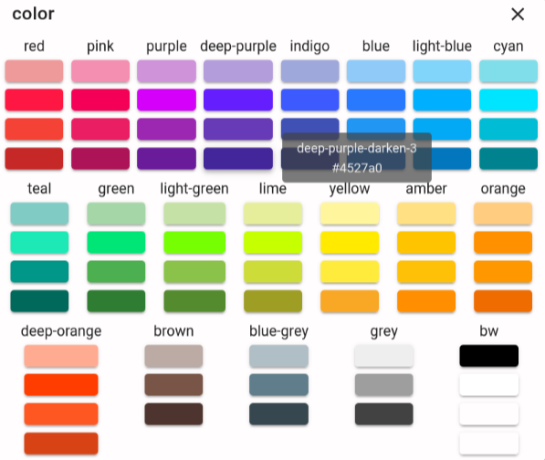
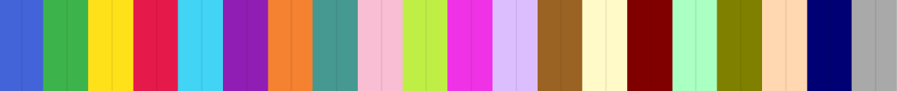

# Colors and themes

FlexDash has three concepts that relate to colors: the material design color palette, the
plotting color palette, and the theme.

## Theme

FlexDash uses the theming support in Vuetify but it is very spare in colors.
It provides a light theme and a dark theme that can be switched using a control at the top-right
corner of the dashboard.
The theme can also be set in the URL by adding a `?theme=dark` query string.

The FlexDash UI itself is kept almost color-free on purpose with the assumption that the contents
of the widgets will dazzle with colors and that the FlexDash frames and surfaces should remain
muted and neutral.

As a result, FlexDash uses a single color, called "primary", which is the Node-RED red
by default. Currently this cannot be changed other than by editing
`src/plugins/vuetify.js` and rebuilding FlexDash.
The primary color is used as default color for buttons and such where is can be changed easily.
The only place the primary color always shows up is as the color of the selected tab.

<figure markdown>
{align="right" width="60%"}
The vuetify theme also defines the colors of surfaces, such as the off-white and almost-black
colors of widgets for the light respectively dark theme. 
</figure>

To-do: provide some way to change the primary color from the node-RED dashboard config node.

To-do: the default light/dark theme cannot currently be changed other than through the query string.
Doing this properly will involve some cookies so users' preferences can be remembered...

## Material design palette

FlexDash inherits the material design palette from Vuetify (https://next.vuetifyjs.com/en/styles/colors/).
This palette consists of 19 colors (red, pink, purple, deep-purple, ...) and
14 variations for each of these colors (base, lighten-1 ... lighten-5, darken-1 ... darken-4,
accent-1 ... accent-4)!

<figure markdown>
{width="100%"}
<figcaption>Material design colors with lighten-3, darken-3, and accent-3 variants.
</figure>

Many widgets accept color props and these can be set to any of these colors by name, e.g.
`red-lighten-3`, `dark-purple-accent-3` or `green` (the "-base" suffix must be omitted).
FlexDash includes a color picker that makes it easy to choose the base colors as well as the
lightne-3, darken-3, and accent-3 variants visually. To-do: provide a way to change the
variant from -3 to -1..-5.

When setting the value of a color prop it is recommended to use the color name instead of its
hex value (`#000000`) because Vuetify automatically switches the color of text overlaid over
the color to white or black for readability.
This only happens with named colors and not with hex values.
Also, it's much easier to understand a color name later on than a hex value...

## Plotting palette

Widgets that plot data using uPlot use a special palette of 20 "maximally distinguishable" colors
from https://sashamaps.net/docs/resources/20-colors/.
This palette consists of the color sequence
blue, green, yellow, red, cyan, purple, orange, teal, pink, lime, magenta, lavender, brown, beige,
maroon, mint, olive, apricot, navy, and grey.

<figure markdown>
{width="100%"}
<figcaption>Plotting palette with 20 colors from blue to grey.
</figure>

Important: while the names of these colors overlap with the material design colors the values
are from a different palette, e.g. the red in the plotting palette is a different red than
the red in the material design color palette!

To-do: see whether a variation of this palette can be constructed from the material design colors.
