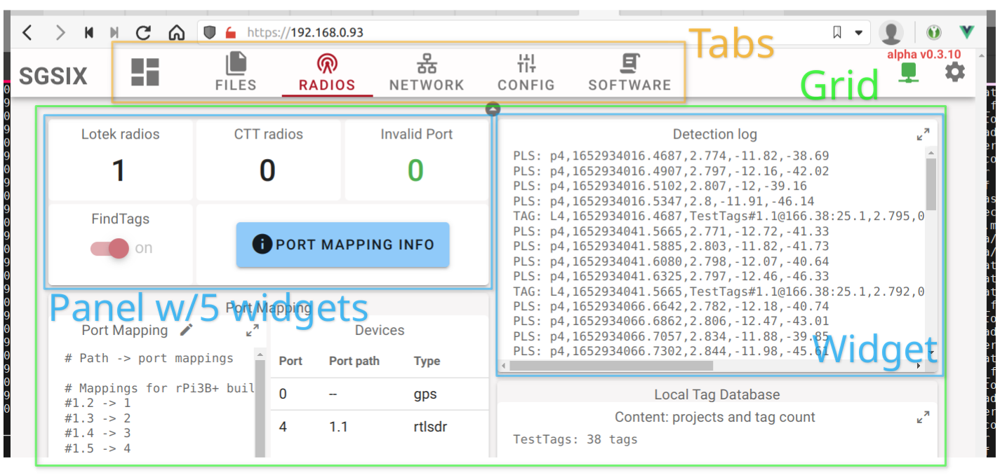
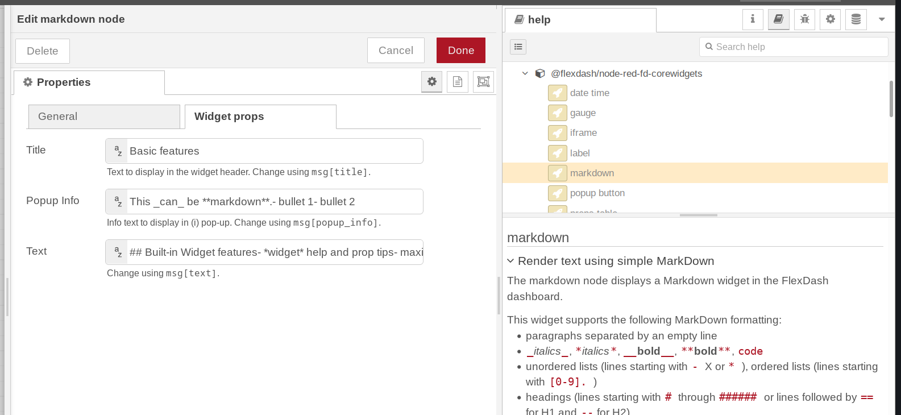
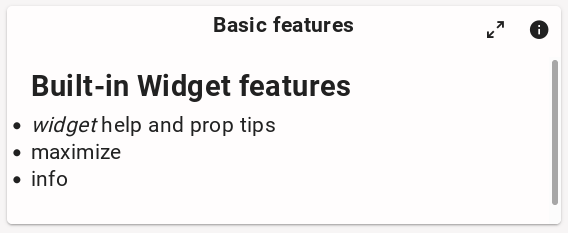
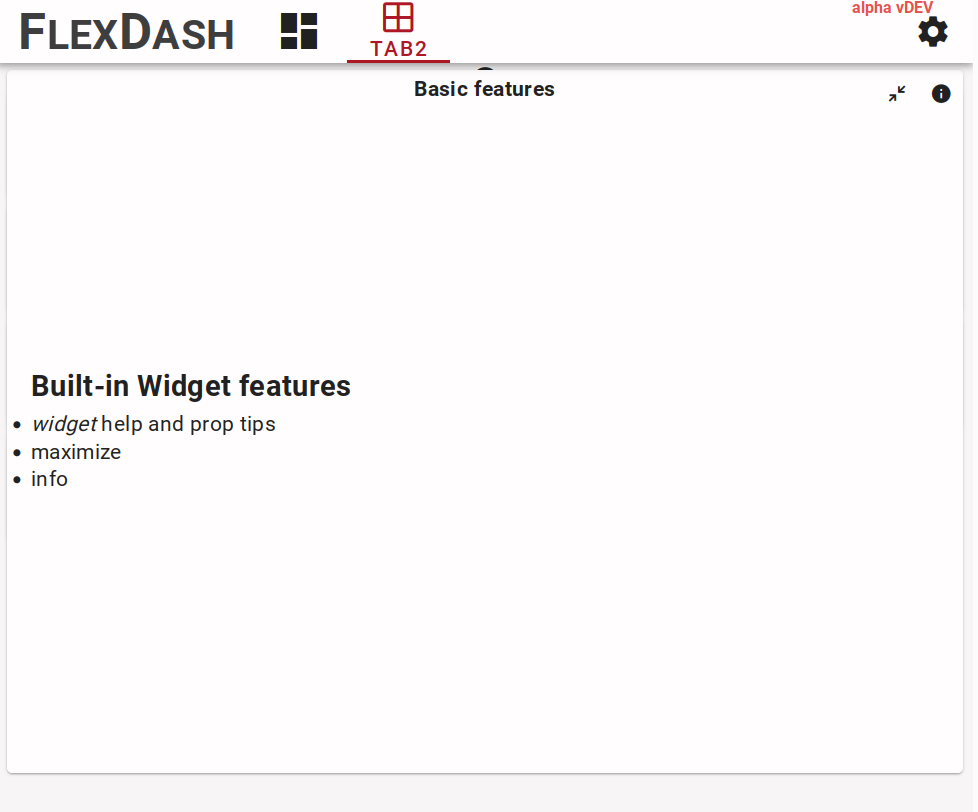
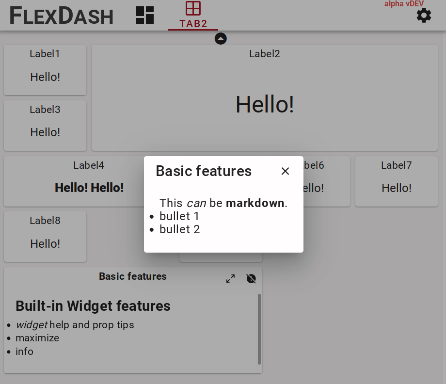

# Core Concepts

## Tabs, grids, panels, widgets

The FlexDash UI is organized hierarchically in tabs, grids, panels, and widgets. Panels are
optional in that widgets can be placed directly into grids.

__Tabs__ are full pages that display information. Each tab has an icon and/or a name and these are
shown in the top-nav bar or the "hamburger button" activated left-nav on small devices.

<figure markdown>
{width="708"}
<figcaption>A dashboard with multiple tabs is shown, the currently open tab has one grid with
a mix of panels and widgets.
</figure>

Each tab can have one or multiple __grids__ filled with widgets. Each grid spans the full width of
the page and has variable height depending on the widgets it contains.
The grid uses the relatively new CSS grid functionality.

All widgets in a grid are in a 1-dimensional order, they are dropped into the grid in that order
starting at the top-left corner and going across to the right and then wrapping to the next row.

A __widget__ is a display element that visualizes some data. It looks like a card in the UI and may
have a title. A typical widget has a number of inputs called _props_ (short for _properties_)
that can be set to a default value in the correspoding Node-RED node's properties tab.
All the properties can also be set/overridden dynamically using Node-RED messages.
It is thus just as easy to change, for example, the color or label of a gauge as its value.

There is a special __panel__ widget that can contain other widgets. The panel is an empty card
that contains a CSS grid with a specific number of columns and rows.
This grid can then be filled just like a grid.

The important difference is that the panel's CSS grid does _not_ reflow or
change with display size.
Once configured to have a certain number of rows and columns and filled
with an arrangement of widgets everything will stay exactly like that regardless of display or
browser window resizing. This allows complex arrangements of widgets to be created that contain a
number of visualizations and input elements whose placement relative to one another is important.

(To be exact, the panel's grid columns and rows _can_ expand slightly to fully fill the card,
this happens as the outer grid's columns also expand slightly to fill the width of the page).

## Built-in widget features

All widgets have a `title` prop and a `popup_info` prop.
The title is shown at the top-center of the widget by default, but this can be overridden
by the widget's imlpementation. The gauge widget is an example for that.

<figure markdown>
{width="793"}
<figcaption>Screen shot of the Node-RED editor showing built-in widget features: title and
popup_info props, tips below each prop entry field, and widget help text in the info
panel on the right.
</figure>

The popup info prop, if set, causes a small (i) icon to be shown at the top-right of the widget
and when clicked, this brings up a pop-up panel displaying the text of the prop using
markdown formatting. This is intended to provide additional info about what the widget shows.
Giben that any prop can be set dynamically, this could even be used to display time-sensitive
info.

<figure markdown>
{width="284" align="left"}
<figcaption>The widget from above showing title and text, plus the maximize and info icons in
the upper right hand corner.
</figure>

<figure markdown>
{width="266" align="left"}
{width="307" align="left"}
<figcaption>Left: the widget from above maximized. Right: popup info shown.
</figure>

Each widget node has help text in the Node-RED editor's "info" pane and each widget prop
has a short help tip below the text entry field, including info on which field of an
incoming `msg` can be used to set the prop dynamically.

The help text comes from the `help` property in the widget's component definition and the 
tips come from the `tip` field in each prop's definition in the component.

Many widgets have an icon to maximize the widget so it can be read more easily.
This is enabled by adding a `full_page: true` field to the widget's component definition.

## Iframes

In addition to the normal tabs, grids, and widgets it is possible to embed content from other
sites into FlexDash using HTML IFrames. There are 3 different iframes to choose from: tab iframes,
grid iframes and widget iframes.

Widget iframes are the simplest: they have a URL input and create an iframe the size of the widget
into which the content from the URL is loaded.

Tab iframes are more complex in order to allow portions of sites with their own tabs to be embedded
efficiently in FlexDash, this is particularly relevant to the std Node-RED dashboard.
An iframe tab consists of
a single iframe that takes up the entirety of the window below the top-nav bar. It is filled from a
URL specified for the tab.

A special feature is that FlexDash provides two "iframe slots", which are used to embed multiple
tabs of a site. The purpose of the slots is to avoid double navigation bars, i.e., the FlexDash
top-nav and the embedded site's top-nav. This works particularly well with the std Node-RED
dashboard because its top-nac can be disabled and it can be navigated using "hash navigation".

Without slots, if multiple tabs were created in FlexDash and each linked to 
a tab of the other site the web page would contain multiple copies of that other site, one
for each such iframe tab. By using slots all the FlexDash tabs that embed the
other site can use the same iframe slot, which means they actually display the same HTML iframe
and cause the tab switch to happen by navigating the content of the iframe. The result is that
there is only a single copy of the other site and switching from one of its tabs to another is
efficient.

## Node-RED nodes, config nodes, and saving the config

The integration of FlexDash into Node-RED relates widgets and nodes 1-1, i.e., each widget
in the dashboard has a corresponding node in some Node-RED flow.
Messages sent to one of these "flexdash nodes" can be processed in the ndoe but are generally
forwarded to the corresponding widget's props.
Similarly, the effect of actions taken by the user on widgets (such as pressing a button) is
to cause the corresponding node to emit a message.

The other elements of FlexDash (dashboards, tabs, grids, and panels) are represented by config nodes in
Node-RED. This means that when a new flexdash node is instantiated a corresponding widget
appears in the dashboard and the location of that widget is determined by which
config node the new node is associated with.

Placing a flexdash node into a panel or grid appends it to the end of the list of widgets
shown in that panel or grid.
The position of a node within the panel or grid or its size cannot be changed from within
the Node-RED editor. Instead, the edit mode of FlexDash must be used.

The overall configuration of the dashboard is saved as part of the flexdash nodes and config nodes.
This means that when flows are deployed in the flow editor the changes are shown in the
dashboard and saved to the standard Node-RED flows file.
If changes are made using the FlexDash edit mode (e.g. reordering or resizing widgets) the
flow editor enables the "deploy" button and a deploy is needed to persist the changes made.

## Dashboard state, data, and messages

Dashboard is based on mirroring state between Node-RED and all connected dashboard instances.
This is in contrast to being based on event messages.
For example, the props (inputs) of a gauge may be set to
`{ color: "green", value: 55, min: 0, max: 100}`
and this state will be sent to all connected browsers as well as any
browsers that connect in the future (unless the state is changed first, of course).
This is contrast to sending a gauge an event message like `set(color, "green")` to
which connected browsers react but which future browsers miss.

The difference between state and event messages may seem insignificant, but it becomes
important when more complex data structures are in play.
For example, a graph widget may plot the temperature in real-time.
In that case, one of its inputs will be the data series, i.e, all the time-temperature
tuples it ought to display in the form of an array.
To add each new data value in real time the new value needs to be appended to the array
and typically the oldest value rotated out.
This means that the entire array needs to be (at least conceptually) re-set and
re-transmitted to all the connected dashboards.
It is not possible to just send a "add a value" message to the widget

The main benefit of the state mirroring employed by FlexDash is that all connected
browsers display the same data independent of when they connected, this avoids the
issue where newly connecting browser don't get some past messages and display
incomplete data.
(Note that it is possible to explicitly send some state only to specific browsers
to implement specific interactions.)

