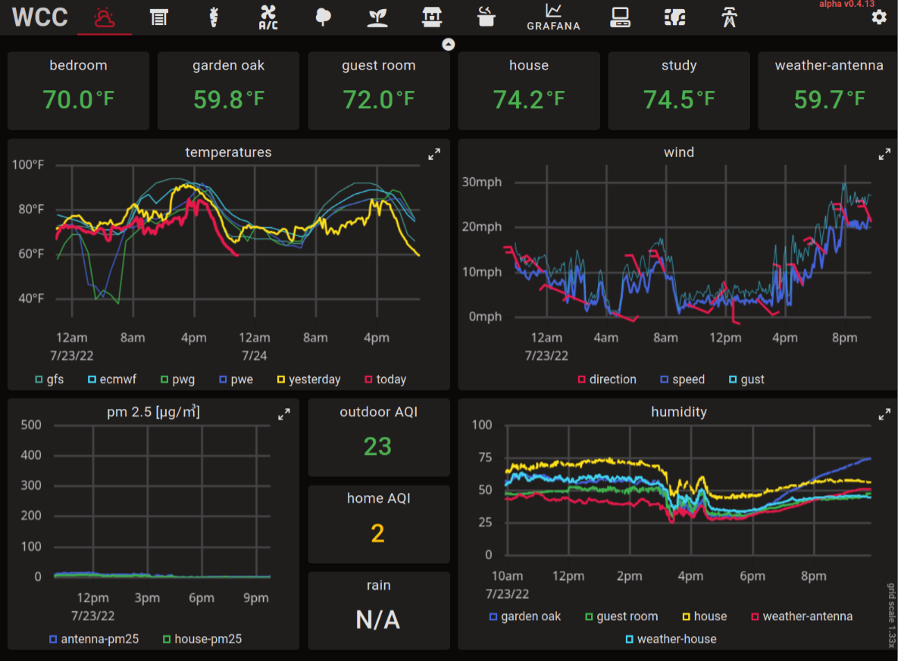
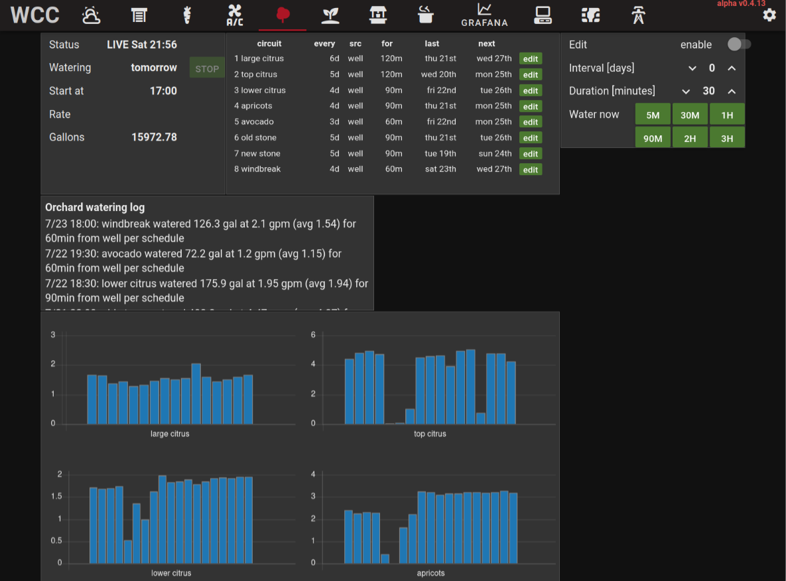
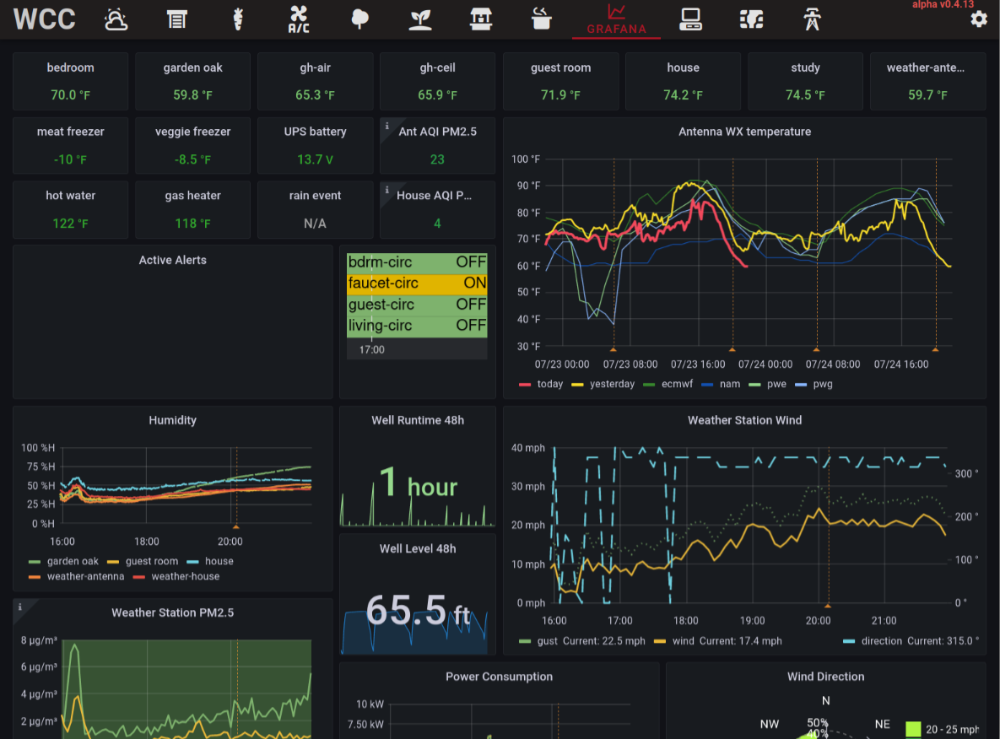

# IFrames

In addition to the normal tabs, grids, and widgets it is possible to embed content from other
sites into FlexDash using HTML IFrames. There are 2 different iframes to choose from: tab iframes
and widget iframes. (FlexDash actually also supports grid iframes, but the Node-RED integration
doesn't and their usefulness is dubious.)

Widget iframes are the simplest: they have a URL input and create an iframe the size of the widget
into which the content from the URL is loaded. The URL is a standard prop so it can be changed
dynamically via a message.

Tab iframes are more complex in order to allow portions of sites with their own tabs to be embedded
efficiently in FlexDash, this is particularly relevant to the std Node-RED dashboard.
An iframe tab consists of a single iframe that takes up the entirety of the window below
the top-nav bar. It is filled from a URL specified for the tab.

The special navigation feature/trick is best explained using the Node-RED dashboard as
example.
Like FlexDash, the Node-RED dashboard is a single page app (SPA) and it navigates from one
tab to another by changing the hash in the URL.
Specifically, the first tab (tab 0) has a URL of the form `http://localhost:1880/ui/#!/0` where
the `#!/0` designates the tab number. The second tab (tab 1) will have the same URL ending
with `#!/1`, etc.

The trick is that changing the iframe's URL from `http://localhost:1880/ui/#!/0` to
`http://localhost:1880/ui/#!/1` causes the embedded Node-RED dashbaord to switch from the first
tab to the second _without reloading_.

In addition to this navigation trick, FlexDash does not unload the contents of an iframe tab
when navigating to a regular tab. This means that rapidly switching back and forth between
a FlexDash tab and an IFrame tab does not reload anything and is very fast.

Finally, FlexDash provides two IFrame "slots", where each slot is such a preserved iframe.
This means that slot-a can be reserved for embedded Node-RED dashboard tabs and slot-b can
be used for other sites. This causes the Node-RED dashboard not to be unloaded.

Note that there is a memory penalty to not unloading the iframe content.
It would most likely be best to unload after a certain time of non-use...

The following screen shots show a FlexDash dashboard with some FlexDash tabs, some
Node-RED tabs, and one Grafana tab.

<figure markdown>

<figcaption>Dashboard with many tabs showing one of the FlexDash "native" tabs, i.e.,
a normal grid with widgets.
</figure>

<figure markdown>

<figcaption>The same dashboard showing one of the embedded (iframe'd) Node-RED dashboard tabs.
The Node-RED dashboard's navigation title bar is set to `hidden` since the tab-to-tab navigation
is replaced by FlexDash's tabs.
</figure>

<figure markdown>

<figcaption>The same dashboard showing an embedded Grafana dashboard page using Grafana's kiosk
mode to hide the Grafana navigation.
</figure>
