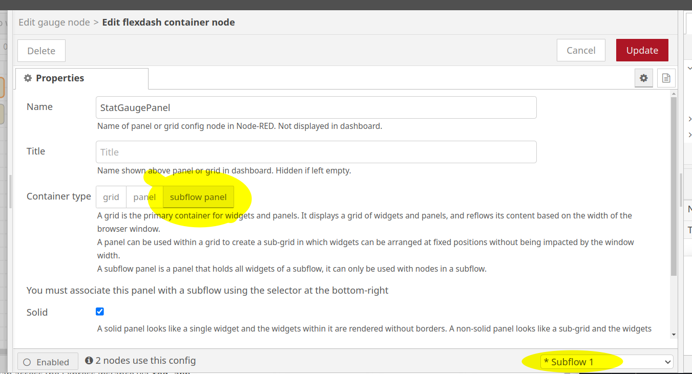
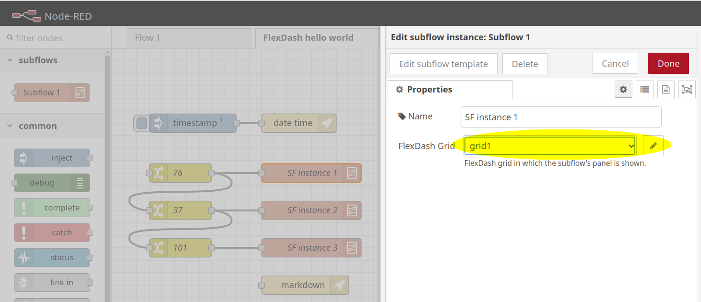

# Node-RED Subflows

FlexDash has limited support for Node-RED subflows!
A subflow is a flow that can be instantiated multiple times in other flows where it looks
like a regular node.

FlexDash supports subflows as follows:
- FlexDash widget nodes can be placed into a subflow
- they all must be associated with one FlexDash "Subflow Panel" config node
- every time the subflow is instantiated a new copy of the panel is shown in the dashboard
- each of these panels can be placed into any grid, i.e. shown anywhere in the dashboard

The main limitations are:
- it is not possible to nest subflows, i.e., FlexDash widget nodes cannot be placed into a
  subflow that is instantiated in another subflow (this could be made to work in the future)
- the widgets in a subflow must all be in one subflow panel and that subflow panel can contain
  only those widgets

The implementation of this feature contains some ugly hacks due to missing APIs in the flow editor
in particular, it should therefore be comsidered quite experimental.

## Creating a Subflow

To create a subflow with FlexDash nodes proceed with creating the subflow as usual and add
FlexDash widget nodes.

<figure markdown>
{align="right" width="75%"}

When adding the first FlexDash node, instead of associating it with a grid or panel, create
a subflow panel.

This subflow panel must further be restricted to the subflow using the selector at the
bottom-right.
</figure>

When adding subsequent FlexDash nodes associate them with the same subflow panel.

## Instantiating a Subflow

To instantiate a subflow that has FlexDash nodes proceed as usual by placing the subflow
node into a flow.

<figure markdown>
{align="right" width="75%"}

Then edit the subflow instance node and choose which FlexDash grid or panel
it should appear in.
</figure>

## Editing a subflow

The widgets in a subflow can be edited as usual in the Node-RED flow editor.
They can also be edited in the FlexDash dashboard using any instance of the subflow.
In both cases, edits affect all instances.
